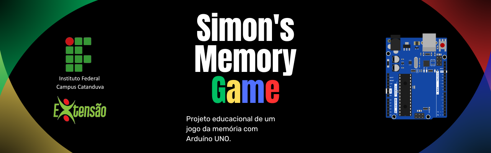
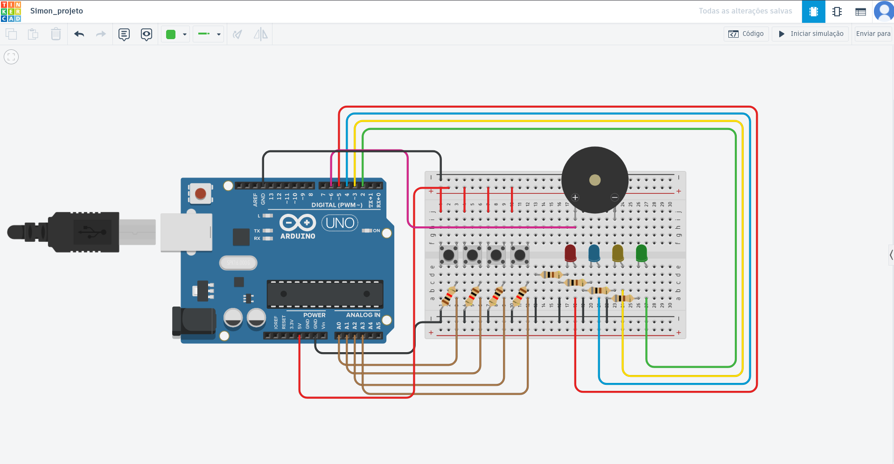

<h1>Arduíno Simon Game</h1>

Projeto desenvolvido no curso de extensão <strong>Arduino e Lógica de Programação para Sistemas Embarcados</strong>,
oferecido pelo <strong>Instituto Federal de Educação, Ciência e Tecnologia de São Paulo (IFSP) – Campus Catanduva</strong>.

Este projeto implementa um jogo eletrônico inspirado no clássico
<strong>Simon</strong>, utilizando um microcontrolador atmega328p (Arduino),
LEDs coloridos, botões físicos e um buzzer para geração de feedback
sonoro.

O objetivo do jogo é memorizar e repetir sequências de cores geradas
pelo sistema. A cada rodada a sequência aumenta, exigindo maior
capacidade de memória e tempo de reação do jogador.

<h2>Participantes do Projeto</h2>

<ul>
<li>Aparecido Orlando Virgili Neto</li>
<li>Breno Souza Bernardi</li>
<li>Bruno Travagli Sereço</li>
<li>Daniel Lourenço Chereze Aparecida</li>
<li>Diego Martins de Aquino</li>
<li>Diogo Hantke Rodrigues Garcia</li>
<li>Leticia Polatto de Novaes</li>
<li>Luiz dos Santos Menino Neto</li>
<li>Naiane Garcia da Silva</li>
<li>Pedro Henrique Fuzaro Mori</li>
<li>Rafael Rebolo Belarmino</li>
<li>Samara Hélem Fonseca</li>
<li>Thiago Augusto Savenhago</li>
<li>Vinícius Souza Cardozo</li>
<li>Wesley Mateus Basso</li>
</ul>

<h2>Orientação</h2>

<ul>
<li>Prof. Paulo Palota</li>
<li>Prof. Ricardo Joaquim</li>
<li>Prof. Cristiano Donizeti Ferrari</li>
</ul>

<h2>Sumário</h2>

<ul>
<li><a href="#sistema">Sistema de Arquivos</a></li>
<li><a href="#pinos">Mapa de Pinos</a></li>
<li><a href="#execucao">Execução do Programa</a></li>
<li><a href="#estrutura">Estrutura do Firmware</a></li>
<li><a href="#funcionamento">Funcionamento do Jogo</a></li>
<li><a href="#codigo">Explicação do Código</a></li>
<li><a href="#melhorias">Melhorias Futuras</a></li>
<li><a href="#objetivo">Objetivo Educacional</a></li>
</ul>

<h2 id="sistema">Sistema de Arquivos</h2>

<pre><code>
.
├── simon/
│   └── simon.ino
│
├── assets/
│   ├── circuito_tinkercad.png
│   ├── circuito_proteus.png
│   └── banner_projeto.png
│
└── README.md
</code></pre>

<ul>

<li><strong>simon/</strong> — firmware principal do Arduino.</li>

<li><strong>assets/</strong> — imagens de circuito e simulações.</li>

<li><strong>README.md</strong> — documentação do projeto.</li>

</ul>

<h2 id="componentes">Lista de Componentes</h2>

A tabela abaixo apresenta os componentes eletrônicos utilizados na
montagem do jogo Simon baseado em Arduino.

<table border="1" cellpadding="8">

<tr>
<th>Componente</th>
<th>Quantidade</th>
<th>Descrição</th>
</tr>

<tr>
<td>Arduino Uno R3</td>
<td>1</td>
<td>Microcontrolador responsável pela execução do firmware do jogo</td>
</tr>

<tr>
<td>Protoboard 400 pontos</td>
<td>1</td>
<td>Placa de pinos de prototipagem</td>
</tr>

<tr>
<td>Push Button (Botão)</td>
<td>4</td>
<td>Utilizados para entrada de comandos do jogador</td>
</tr>

<tr>
<td>LED Vermelho</td>
<td>1</td>
<td>Indicação visual da cor vermelha</td>
</tr>

<tr>
<td>LED Azul</td>
<td>1</td>
<td>Indicação visual da cor azul</td>
</tr>

<tr>
<td>LED Amarelo</td>
<td>1</td>
<td>Indicação visual da cor amarela</td>
</tr>

<tr>
<td>LED Verde</td>
<td>1</td>
<td>Indicação visual da cor verde</td>
</tr>

<tr>
<td>Resistor 330 Ω</td>
<td>5</td>
<td>Limitadores de corrente para os LEDs</td>
</tr>

<tr>
<td>Resistor 10 kΩ</td>
<td>4</td>
<td>Resistores utilizados no circuito dos botões</td>
</tr>

<tr>
<td>Piezo Buzzer</td>
<td>1</td>
<td>Responsável pela geração de feedback sonoro do jogo</td>
</tr>

</table>

<h2 id="pinos">Mapa de Pinos</h2>

<table>
<tr>
<td>

<table border="1" cellpadding="8">
<tr>
<th>Componente</th>
<th>Pino</th>
</tr>
<tr><td>LED Verde</td><td>2</td></tr>
<tr><td>LED Amarelo</td><td>3</td></tr>
<tr><td>LED Azul</td><td>4</td></tr>
<tr><td>LED Vermelho</td><td>5</td></tr>
<tr><td>Buzzer</td><td>6</td></tr>
<tr><td>Botão Vermelho</td><td>A0</td></tr>
<tr><td>Botão Azul</td><td>A1</td></tr>
<tr><td>Botão Amarelo</td><td>A2</td></tr>
<tr><td>Botão Verde</td><td>A3</td></tr>
</table>

</td>
<td>

</td>
</tr>
</table>

<h2 id="execucao">Diagrama visual da montagem do Simon</h2>

    

<h3 id="tinkercad">Como executar no Tinkercad</h3>

<ol>
<li>Acesse o link do projeto clicando em <a href="https://www.tinkercad.com/things/298jtiYipKU-simonprojeto" target="_blank">simon_tinkercad</a>.</li>
<li>Faça login na sua conta Tinkercad (ou crie uma gratuitamente).</li>
<li>Na tela do projeto, clique em <strong>“Iniciar Simulação”</strong> (Start Simulation).</li>
<li>Use os botões virtuais do circuito para jogar o Simon, observando os LEDs e ouvindo o buzzer.</li>
<li>Para pausar ou reiniciar a simulação, use os controles do Tinkercad (Stop Simulation / Reset).</li>
</ol>

<h2 id="execucao">Execução do Programa no arduíno físico</h2>

<ol>

<li>Instalar Arduino IDE</li>

<li>Abrir arquivo

<pre><code>simon/simon.ino</code></pre>

</li>

<li>Selecionar placa Arduino Uno</li>

<li>Selecionar porta serial (COM 3, COM 5, etc)</li>

<li>Clicar em Upload</li>

</ol>

<h2 id="estrutura">Estrutura do Firmware</h2>

<ul>
<li>setup()</li>
<li>loop()</li>
<li>start()</li>
<li>gaming()</li>
<li>btnEvent()</li>
<li>ledEvent()</li>
<li>gameOver()</li>
</ul>

<h2 id="funcionamento">Funcionamento do Jogo</h2>

<ol>

<li>Sistema inicia em modo espera</li>

<li>Jogador pressiona um botão</li>

<li>Jogo começa</li>

<li>Sistema gera sequência de LEDs</li>

<li>Jogador repete sequência</li>

<li>Sequência aumenta</li>

<li>Erro encerra o jogo</li>

</ol>

<h2 id="codigo">Explicação do Código</h2>

<h3>Função start()</h3>

<pre><code>
int start(){ 
    int numberBtn = -1;
    int numberFirst = -1;
    int timeNumber = 1000;

    int listLeds[]{
        LEDGREEN, 
        LEDYELLOW, 
        LEDBLUE, 
        LEDRED      
    };
    
    int index = 0;
    static unsigned long previousTime = 0;
        
    while(numberBtn < 0){

        numberBtn = btnEvent(timeNumber);
        
        if(numberBtn >= 0){
            numberFirst = numberBtn;
            Serial.println("started");
            return numberFirst;
        }

        if((millis() - previousTime) >= 200){

          previousTime = millis();

          digitalWrite(listLeds[(index+3)%4], LOW);
          digitalWrite(listLeds[index], HIGH);

          index++;

          if(index >= 4) index = 0;
        }
    }

    return 0;
}
</code></pre>

Responsável por iniciar o jogo e indicar visualmente que o sistema está aguardando a primeira ação do jogador.

<ul>
<li>Inicializa variáveis de controle do botão pressionado, do primeiro número da sequência e do tempo de espera.</li>
<li>Define um array com os pinos dos LEDs para gerar o efeito de “luz de espera”.</li>
<li>Usa um loop que permanece ativo até que o jogador pressione um botão.</li>
<li>Verifica continuamente se algum botão foi pressionado através da função <code>btnEvent()</code>.</li>
<li>Quando um botão é pressionado, define esse botão como o primeiro da sequência e retorna seu índice, iniciando o jogo.</li>
<li>Enquanto nenhum botão é pressionado, acende os LEDs em sequência para gerar feedback visual de espera, usando <code>millis()</code> para evitar delays bloqueantes.</li>
<li>Controla o índice dos LEDs garantindo que o efeito de luz cicla continuamente enquanto o sistema aguarda a interação do jogador.</li>
</ul>

<h3>Função ledEvent()</h3>

<pre><code>
void ledEvent(int numberLed, int timeNumber){

    int listLeds[]{
        LEDGREEN, 
        LEDYELLOW, 
        LEDBLUE, 
        LEDRED      
    };

    for(int i = 0; i < 4; i++)
        digitalWrite(listLeds[i], LOW);

    switch(numberLed){

      case 0:
        digitalWrite(LEDRED, HIGH);
        tone(BUZZER, 440, timeNumber);
        break;  
    
      case 1:
        digitalWrite(LEDBLUE, HIGH);
        tone(BUZZER, 494, timeNumber);
        break;  
    
      case 2:
        digitalWrite(LEDYELLOW, HIGH);
        tone(BUZZER, 523, timeNumber);
        break;  
    
      case 3:
        digitalWrite(LEDGREEN, HIGH);
        tone(BUZZER, 587, timeNumber);
        break;
    }
    
    delay(timeNumber);

    for(int i = 0; i < 4; i++)
        digitalWrite(listLeds[i], LOW);

    noTone(BUZZER);
}
</code></pre>

Responsável por gerar feedback visual e sonoro para cada LED do jogo.

<ul>
<li>Define um array com os pinos dos LEDs.</li>
<li>Desliga todos os LEDs antes de iniciar o evento.</li>
<li>Acende o LED correspondente ao número recebido.</li>
<li>Toca a frequência correspondente no buzzer.</li>
<li>Aguarda a duração do evento usando <code>delay()</code>.</li>
<li>Desliga todos os LEDs e para o buzzer ao final do evento.</li>
</ul>

<h3>Função btnEvent()</h3>

<pre><code>
int btnEvent(int timeNumber){

    int listBtn[] = {
        BUTTONRED,
        BUTTONBLUE,
        BUTTONYELLOW,
        BUTTONGREEN
    };

    int numberBtn = -1;

    for(int i = 0; i < 4; i++){

        if(digitalRead(listBtn[i]) == HIGH){
            numberBtn = i;
            break;
        }
    }
    
    if(numberBtn >= 0){

        while(digitalRead(listBtn[numberBtn]) == HIGH){
            delay(10);
        }

        ledEvent(numberBtn, timeNumber);
    }

    return numberBtn;
}
</code></pre>

Responsável por ler a entrada do jogador e gerar feedback correspondente.

<ul>
<li>Lê o estado de todos os botões.</li>
<li>Identifica qual botão foi pressionado.</li>
<li>Aguarda a liberação do botão para evitar múltiplos registros.</li>
<li>Aciona a função <code>ledEvent()</code> para gerar feedback visual e sonoro.</li>
<li>Retorna o índice do botão pressionado.</li>
</ul>

<h3>Função gaming()</h3>

<pre><code>
int gaming(int numberFirst){

    bool stateGame = true;

    int listNumber[MAX] = {numberFirst};
    int difficulty = numberFirst;

    int timeNumber = 1000 - (numberFirst*200);

    int btnNumber = -1;
    int lenListNumber = 1;
    int points = 0;
    
    while(stateGame){

      for(int i = 0; i < lenListNumber; i++){
        delay(timeNumber);
        ledEvent(listNumber[i], timeNumber);
      }

      for(int i = 0; i < lenListNumber; i++){
        
        btnNumber = -1;

        while(btnNumber < 0){
            btnNumber = btnEvent(timeNumber);
        }

        Serial.println(btnNumber);

        if(btnNumber == listNumber[i]){
          points++;
        }else{
          stateGame = false;
          break;
        }
      }

      if(!stateGame) break;

      if(lenListNumber < MAX){
        listNumber[lenListNumber] = random(0,4);
        lenListNumber++;
      }
    }
    
    return points;
}
</code></pre>

Função que implementa toda a lógica do jogo Simon.

<ul>
<li>Inicia o estado do jogo e armazena a primeira sequência.</li>
<li>Exibe a sequência de LEDs para o jogador usando <code>ledEvent()</code>.</li>
<li>Solicita a entrada do jogador e verifica se corresponde à sequência.</li>
<li>Incrementa a pontuação a cada acerto.</li>
<li>Adiciona um novo elemento aleatório à sequência se o jogador acertar.</li>
<li>Encerra o jogo caso o jogador erre e retorna a pontuação final.</li>
</ul>

<h3>Função gameOver()</h3>

<pre><code>
void gameOver(){

    int melody[] = {784, 659, 523, 392, 330, 262};
    int duration = 200;

    for(int i = 0; i < 6; i++){
        tone(BUZZER, melody[i], duration);
        delay(duration);
    }

    noTone(BUZZER);

    for(int i = 0; i < 5; i++){

        digitalWrite(LEDGREEN, HIGH);
        digitalWrite(LEDYELLOW, HIGH);
        digitalWrite(LEDBLUE, HIGH);
        digitalWrite(LEDRED, HIGH);

        delay(150);

        digitalWrite(LEDGREEN, LOW);
        digitalWrite(LEDYELLOW, LOW);
        digitalWrite(LEDBLUE, LOW);
        digitalWrite(LEDRED, LOW);

        delay(150);
    }

    delay(100);
    resetFunc();
}
</code></pre>

Responsável por finalizar o jogo quando o jogador erra.

<ul>
<li>Toca uma melodia de derrota utilizando o buzzer.</li>
<li>Pisca todos os LEDs para indicar o fim do jogo.</li>
<li>Reinicia o microcontrolador chamando <code>resetFunc()</code>.</li>
<li>E assim retorna ao estado inicial de start do jogo</li>
</ul>
<h2 id="melhorias">Melhorias Futuras</h2>

<ul>

<li>Remover delays usando millis()</li>

<li>Adicionar display</li>

<li>Salvar recorde em EEPROM</li>

<li>Suporte a múltiplos jogadores</li>

<li>Projeto de PCB dedicada</li>

</ul>

<h2 id="objetivo">Objetivo Educacional</h2>

Este projeto foi desenvolvido com o objetivo de consolidar conhecimentos
de lógica de programação aplicada a sistemas embarcados utilizando Arduino.

<ul>

<li>lógica de programação embarcada</li>

<li>manipulação de GPIO</li>

<li>controle de hardware</li>

<li>organização de firmware</li>

<li>implementação de algoritmos em microcontroladores</li>

</ul>
